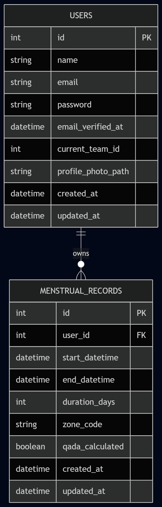
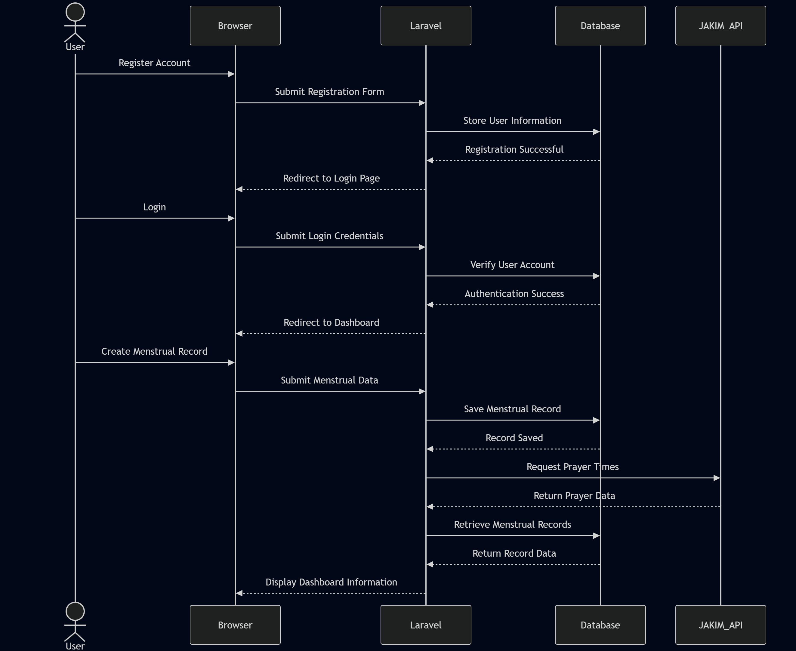

## Menstrual and Qada Tracker System
## Group Members
**Alya Qistina Nadia binti Idris (231134)**
* Leader
* Setup Laravel project 
* Configure GitHub repository
* Manage backend integration
* Assist route integration
* Create navbar/footer
* Manage website theme/layout
* Handle Blade template layout
* Display prayer times on dashboard
* Display reminder notifications
* Handle API frontend display
* Handle loading/error messages

**Putri Nur Batrisyia binti Azizul (2412444)**
* Design database tables
* Create ERD
* Create Sequence Diagram
* Setup MySQL database
* Create Laravel migrations
* Develop Eloquent Models
* Setup foreign keys and relationships
* Design landing page/homepage
* Design login page
* Design register page
* Create authentication forms
* Style input forms using Tailwind CSS
* Connect forms with backend routes
* Connect Laravel with JAKIM API
* Implement responsive layout for multiple pages
  
**Wan Nur Hanees binti Wan Shukri (2415978)**
* Create CRUD backend functions
* Create period controller
* Setup CRUD routes
* Create validation logic
* Store/retrieve period records
* Design dashboard layout
* Create cycle summary section
* Create history page UI
* Display records dynamically
* Process JSON response
* Extract prayer time data
* Format prayer information

**Wan Nur Insyirah binti Wan Rosli (2410848)**
* Create qada’ prayer logic
* Create hari suci calculation
* Create next cycle prediction logic
* Build calculation functions
* Design calendar tracker
* Display prediction section
* Design prayer reminder section
* Compare period time with prayer time
* Determine qada’ prayer needed
* Test calculation accuracy

## 1. Introduction

SuciTrack is a specialized, Laravel-based web application cater assist Muslim women in tracking their menstrual cycles (Hayd) and periods of purity (Tuhr) in strict accordance with Shariah (Islamic jurisprudence) guidelines.

Navigating the complexities of Islamic rulings regarding prayer (Salah), fasting (Sawm), and other acts of worship during and after menstruation can be challenging. SuciTrack addresses this by replacing manual calculations with an automated, reliable digital solution. By combining the robust Model-View-Controller (MVC) architecture of Laravel with precise jurisprudential logic, the platform empowers users to maintain the five daily prayers and accurately manage their religious obligations.

## 2. Problem Statement & Objectives

### 2.1 Problem Statement
Many contemporary period tracking applications are designed purely from a medical or lifestyle perspective. They lack the specific logical parameters required to determine Islamic purity, such as tracking the exact duration of a valid period, identifying irregular bleeding (Istihadah), or calculating missed prayers that require replacement (Qada'). This leaves users to manually calculate their end period time, often leading to confusion regarding their validation for acts of worship.

### 2.2 Project Objectives
- Provide an interactive website for users to login, view, and manage their current and historical cycle data.
- Eliminate manual calculation errors by automating the determination of purity days, valid menstruation limits, and transitional phases.
- Support users in fulfilling their religious duties by implementing a structured system to track and clear Qada' (missed) prayers.

## 3. System Architecture

### 3.1 Core Features
The application is built around four primary functional pillars:
- Secure user authentication through registration and login systems to ensure user data protection and privacy.
- Menstrual Records Management (CRUD) Create, Read, Update, and Delete capabilities allowing users to log start/end times.
- A visual featuring current cycle status, days of purity, unresolved qada' prayers, zone selection based on systemic calculations.
- Historical trends, predictive modeling for future cycles to inform users.

### 3.2 Technical
Backend Framework: 
- Laravel (PHP)
- JavaScript

Frontend Interface: 
- Blade Templating Engine, 
- Tailwind CSS (augmented with Livewire for real-time reactivity)

Database: 
- MySQL

## 4. Features & Functionalities

### 4.1 User Authentication
The system provides a secure authentication mechanism that allows users to create accounts, log in and access their personal menstrual tracking data. Authentication is implemented using Laravel's built-in authentication system to ensure user privacy and data security.

**Functions:**

- User registration
- User login
- User logout
- Session management
- User data protection

### 4.2 Menstrual Records Management
SuciTrack allows users to manage menstrual cycle records through a complete Create, Read, Update and Delete (CRUD) system. Users can record the start and end dates of their menstrual periods, enabling the system to calculate cycle-related information automatically.

**Functions:**

- Add new menstrual records
- View menstrual history
- Edit existing records
- Delete records
- Store cycle duration information
- Track purity periods (Tuhr)

### 4.3 Prayer Time Integration
The system integrates with JAKIM Prayer Time API to retrieve accurate prayer schedules based on selected zones. This ensures that prayer-related calculations are aligned with official Malaysian prayer times.

**Functions:**

- Retrieve prayer times from JAKIM API
- Display daily prayer schedule
- Support prayer zone selection
- Update prayer information dynamically

### 4.4 Dashboard Monitoring
A centralized dashboard provides users with an overview of their menstrual status and related information. Important cycle information is displayed in organized and user-friendly interface.

**Functions:**

- Display current menstrual status
- Display recorded cycle information
- Display history of menstrual records
- Predict next menstrual cycle
- Show prayer-related information
- Quick access to system features and modules

### 4.5 Qada' Prayer Tracking
Qada' module assists users in identifying prayers that may need to be replaced due to menstrual periods. The system supports the management and monitoring of qada' prayer records.

**Functions:**

- Record qada' prayer information
- Manage qada' prayer records
- Display qada' prayer status

### 4.6 Responsive User Interface
This application is designed using Tailwind CSS and Blade templates to provide a clean and responsive user experience across different devices.

**Functions:**

- Responsive page layout
- Modern user interface
- Consistent navigation design
- Mobile-friendly display
- Interactive forms and components

## 5. Entity Relationship Diagram (ERD)

    

    <b>Figure 1: Entity Relationship Diagram (ERD) of SuciTrack</b>

The database consists of two main entities: USERS and MENSTRUAL_RECORDS. 
A one-to-many relationship exists between the tables, where one user can create multiple menstrual records while each menstrual record belongs to only one user.

## 6. Sequence Diagram

    

    <b>Figure 2: Sequence Diagram of SuciTrack</b>

The sequence diagram illustrates the interaction between the user, SuciTrack system, database, and JAKIM API. The process begins when a user registers an account and logs into the system. The application then verifies the user's credentials through the database before granting access to the dashboard. When a menstrual record is created, the system stores the record in the database and retrieves prayer time information from the JAKIM API based on the selected zone. The processed data is then displayed on the dashboard, allowing users to monitor their menstrual cycle information and prayer-related records through a centralized interface.

## 7. User Interface (Completed System)

# SuciTrack – Menstrual Purity Tracker

## 8. Implementation Details
### routes.web.php

### Routes Configuration Explanation
The 'web.php' file in Laravel defines the web routes of the application. Routes determine how incoming HTTP requests are handled and which controller methods or views are returned. In this project, the routes are organized into two main categories: **public routes** and **authenticated routes**.

1. **Public Route**  
   - The root URL ('/') is mapped to the 'landing' view.  
   - This serves as the public homepage, accessible to all users without authentication.

2. **Authenticated Routes**  
   - These routes are grouped under middleware 'auth' and 'verified', ensuring only logged in and email-verified users can access them.  
   - Key routes include:
     - **Dashboard**: '/dashboard' calls 'DashboardController@index' and displays the main user dashboard.  
     - **Menstrual Records**:  
       - '/menstrual_records/end' calls 'MenstrualController@endCycle' to mark the end of a cycle.  
       - 'Route::resource('menstrual_records', MenstrualController::class)' automatically generates full CRUD operations (create, read, update, delete) for menstrual records.  
     - **Qada Page**: '/qada' calls 'QadaController@index' to display the Qada (missed prayers) page.  
     - **Complete Qada**: '/dashboard/complete-qada/{id}' is a POST route that calls 'DashboardController@completeQada' to mark a specific Qada entry as completed.

3. **Authentication Routes**  
   - The file also includes 'auth.php', which contains all authentication-related routes such as login, registration, and password reset.

### Controller
### MenstrualController

### MenstrualController Explanation

The MenstrualController manages all menstrual cycle records and integrates them with Qada (missed prayers) tracking. It provides CRUD operations, cycle management, and a dashboard view for users.

1. **Index**  
   - Retrieves all menstrual records for the authenticated user, ordered by start date.  
   - Displays them in the `menstrual_records.index` view.

2. **Create & Store**  
   - create() shows a form to start a new cycle.  
   - store() validates input, saves a new record with 'start_datetime', and sets 'end_datetime' as null until the cycle ends.

3. **Edit & Update**  
   - edit() loads a specific record for editing.  
   - update() validates the 'end_datetime', updates the record, deletes old Qada logs, and regenerates Qada entries using the **Qada Engine**.

4. **Destroy**  
   - Deletes a menstrual record and its associated Qada logs.

5. **Dashboard**  
   - Shows the user’s current cycle status ('activeRecord'), whether they are clean ('isClean'), number of purity days since last cycle, and counts of pending and completed Qada prayers.

6. **Qada Engine**  
   - 'generateQada()' calculates missed prayers during the menstrual period.  
   - It fetches prayer times via the **Aladhan API**, checks which prayers fall within the cycle, and auto-generates Qada logs for them.

7. **End Cycle**  
   - Redirects the user to edit the latest active cycle.  
   - If no active cycle exists, it shows an error message.
  
   ### DashboardController

Here’s a short but detailed explanation you can use in your **project report** for the `DashboardController`:

---

### DashboardController Explanation

The 'DashboardController' is responsible for displaying the main dashboard, summarizing menstrual cycle status, purity days, prayer times, and Qada (missed prayers) tracking.

1. **Index Method**  
   - Retrieves the latest menstrual records for the authenticated user.  
   - **Purity Logic**: Calculates `daysOfPurity` (days between cycles or since last ended cycle) and determines whether the user is currently clean (`isClean`).  
   - **Prayer Times**: Fetches today’s prayer times from the WaktuSolat API, with fallback static values if the API fails.  
   - **Qada Calculation**: Iterates through menstrual records to count missed prayers during cycles, then subtracts completed Qada logs to show pending totals.  
   - **Pending Qada**: Retrieves all incomplete Qada logs, ordered by date, and counts them.  
   - **Next Prayer**: Determines the upcoming prayer based on current time, ensuring correct fallback after midnight.  
   - Passes all computed data (`activeRecord`, `daysOfPurity`, `isClean`, `prayer`, `final`, `pendingQadaItems`, etc.) to the `dashboard` view.

2. **Complete Qada**  
   - Marks a specific Qada log as completed by updating its status.  
   - Redirects back to the dashboard with a success message.

3. **getTodayPrayerTimes**  
   - Calls the WaktuSolat API (`https://api.waktusolat.app/v2/solat/KUL`) to fetch prayer times for Kuala Lumpur.  
   - Extracts today’s timings (Subuh, Zohor, Asar, Maghrib, Isya) and returns them in a simplified format.  
   - Returns `null` if the API fails or data is missing.

## 9. Recommendations

## 10. Conclusion
